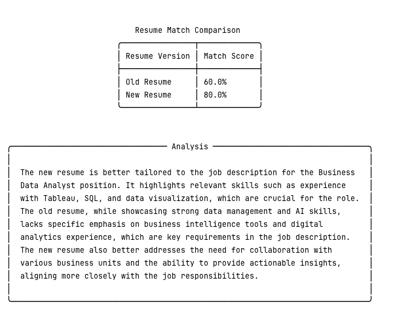

# ResumeAI

ResumeAI is an intelligent resume creation tool that leverages Large Language Models (LLMs) to automatically generate 000s of tailored resumes and cover letters for specific job descriptions. It works as a wrapper for [rendercv](https://github.com/rendercv/rendercv), enhancing its capabilities with AI-powered content generation.



## Key Features

- **AI-Powered Resume Generation**: Automatically creates tailored resumes for specific job descriptions using LLMs
- **Smart Resume Matching**: Compares both your current and newly generated resume against job requirements with detailed scoring
- **Multiple Input Methods**: Process job descriptions from:
    - Text files (.txt)
    - Online job postings (via URLs)
- **Cover Letter Generation**: Optional automated creation of personalized cover letters
- **AI Detection Avoidance**: Integration with WordAI for content rewriting (optional) to avoid AI detection tools
- **Visual Match Scoring**: Clear visual representation of how well your resumes match job requirements
- **Multiple Output Formats**: Generates both YAML and PDF versions of your resume


# Quickstart
1. run poetry install to set up dependencies
2. put your old CVs into `app/user_data/resumes` directory
3. update config.json with:
 - the path to your old CV
 - your name
 - operating mode
 - your theme. Check out themes here: https://github.com/rendercv/rendercv/tree/main/examples

2. Configure your setup in `config.json`:
```json
{
  "name": "Your Name",
  "resume_old_name": "your-current-resume.pdf",
  "mode": "files",  // or "links"
  "theme": "chosen-theme",
  "target_highlights_length_words": 50,  // optional
  "wordai_api_key": "",  // optional
  "multiple_pages": false,
  "write_cover_letter": false
}
```

### Configuration Options

- **mode**: Choose between:
    - `files`: Process job descriptions from text files
    - `links`: Process job descriptions from URLs
- **theme**: Select from available [rendercv themes](https://github.com/rendercv/rendercv/tree/main/examples)
- **target_highlights_length_words**: Set target word count for experience highlights
- **wordai_api_key**: Optional API key for WordAI integration to avoid AI detection
- **multiple_pages**: Allow resume to span multiple pages if needed
- **write_cover_letter**: Enable automatic cover letter generation

## Usage

1. Place your current resume(s) in `user_data/resumes_old/`
2. Choose your operating mode:
    - For `files` mode: Add job descriptions as .txt files in `user_data/job_descriptions/`
    - For `links` mode: Add job posting URLs to `job_descriptions/job_links.json`
3. Run the application

### Directory Usage

- `user_data/resumes_old/`: Store your current resume(s) in PDF format
- `user_data/job_descriptions/`: Place job descriptions as individual .txt files (filename will be used for the new resume)
- `user_data/job_descriptions_processed/`: Automatic storage for processed job descriptions
- `YOUR_NAME_CV.yaml`: Template file that can be customized for the AI generation process

## Advanced Features

- **Resume Matching Analysis**: Visual comparison of how well both old and new resumes match job requirements
- **Custom Instructions**: Ability to specify length and format preferences
- **Automatic File Management**: Processed job descriptions are automatically organized
- **PDF Generation**: Automatic conversion of YAML to professionally formatted PDF resumes

## Notes

- You can move processed job descriptions back to `user_data/job_descriptions` to reprocess them
- The YAML template (`YOUR_NAME_CV.yaml`) can be manually edited for customization
- Job description filenames are used to name the generated resumes